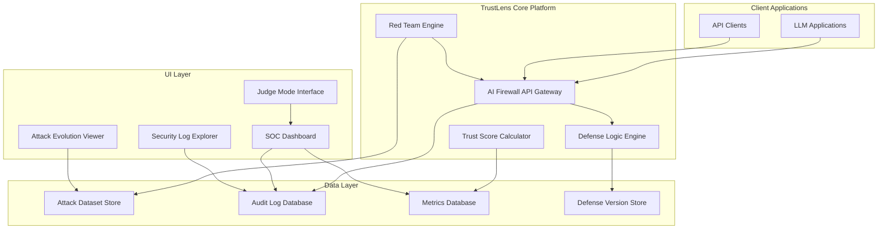

# TrustLens AI Security Platform - Design Document

## Overview

TrustLens is a research-grade AI security platform that provides comprehensive protection for LLM-based systems through autonomous red teaming, quantified trust scoring, and professional SOC-style monitoring. The platform operates as a multi-layered security system where an AI firewall provides real-time protection while an autonomous red team engine continuously evolves attack strategies to test and improve defenses.

The architecture emphasizes measurable security outcomes, complete auditability, and professional cybersecurity workflows. Unlike traditional security tools that focus on network or endpoint protection, TrustLens specifically addresses the unique attack vectors and vulnerabilities inherent in large language model deployments.

## Architecture

### High-Level System Architecture



### Component Interaction Flow

1. **Request Processing**: Client applications send prompts through the AI Firewall API Gateway
2. **Security Analysis**: Defense Logic Engine analyzes prompts using current defense rules
3. **Decision Logging**: All decisions are logged to Audit Log Database with full context
4. **Continuous Testing**: Red Team Engine generates attacks and tests them against the firewall
5. **Metric Calculation**: Trust Score Calculator aggregates performance metrics in real-time
6. **UI Presentation**: SOC Dashboard and specialized views present security data to operators

## Components and Interfaces

### AI Firewall API Gateway

**Purpose**: Primary security checkpoint that analyzes all LLM interactions

**Core Interfaces**:
```typescript
interface FirewallRequest {
  prompt: string;
  context?: string;
  userId?: string;
  sessionId?: string;
}

interface FirewallResponse {
  decision: 'ALLOW' | 'BLOCK' | 'FLAG';
  riskScore: number; // 0-100
  attackCategory: AttackCategory;
  explanation: string;
  processingTime: number;
  ruleVersion: string;
}

interface AttackCategory {
  type: 'PROMPT_INJECTION' | 'JAILBREAK' | 'INSTRUCTION_OVERRIDE' | 'ROLE_MANIPULATION';
  confidence: number;
  indicators: string[];
}
```

**Key Responsibilities**:
- Real-time prompt and output analysis
- Risk score calculation using multiple detection algorithms
- Decision logging with complete audit trail
- Rate limiting and performance monitoring

### Red Team Engine

**Purpose**: Autonomous system for generating and evolving attack strategies

**Core Interfaces**:
```typescript
interface AttackGenerator {
  generateAttacks(count: number, category?: AttackCategory): Promise<Attack[]>;
  mutateAttack(baseAttack: Attack, strategy: MutationStrategy): Promise<Attack>;
  testAttack(attack: Attack): Promise<AttackResult>;
}

interface Attack {
  id: string;
  prompt: string;
  category: AttackCategory;
  parentId?: string; // For tracking evolution lineage
  generation: number;
  metadata: AttackMetadata;
}

interface AttackResult {
  attackId: string;
  success: boolean;
  firewallResponse: FirewallResponse;
  timestamp: Date;
  metrics: TestMetrics;
}
```

**Evolution Strategies**:
- **Instruction Inversion**: Reversing command structures to bypass detection
- **Role Shifts**: Changing assumed personas or contexts within prompts
- **Semantic Rewriting**: Maintaining attack intent while altering surface form
- **Payload Encoding**: Using various encoding schemes to obfuscate malicious content

### Trust Score Calculator

**Purpose**: Quantified security assessment based on measured performance metrics

**Scoring Algorithm**:
```typescript
interface TrustScoreComponents {
  blockRate: number;        // Percentage of attacks successfully blocked
  falsePositiveRate: number; // Percentage of legitimate requests incorrectly flagged
  bypassRate: number;       // Percentage of attacks that succeeded
  regressionPenalty: number; // Penalty for decreased performance vs previous versions
  explainabilityScore: number; // Coverage and quality of decision explanations
}

interface TrustScore {
  overall: number; // 0-100 composite score
  components: TrustScoreComponents;
  trend: 'IMPROVING' | 'STABLE' | 'DECLINING';
  lastUpdated: Date;
  changeReason: string;
}
```

**Calculation Formula**:
```
TrustScore = (
  (blockRate * 0.35) + 
  ((100 - falsePositiveRate) * 0.25) + 
  ((100 - bypassRate) * 0.25) + 
  (explainabilityScore * 0.15)
) - regressionPenalty
```

### Defense Logic Engine

**Purpose**: Versioned security rule system with regression detection

**Core Interfaces**:
```typescript
interface DefenseVersion {
  version: string;
  rules: SecurityRule[];
  deployedAt: Date;
  performance: PerformanceMetrics;
  regressionStatus: 'NONE' | 'DETECTED' | 'CRITICAL';
}

interface SecurityRule {
  id: string;
  name: string;
  pattern: string | RegExp;
  action: 'BLOCK' | 'FLAG' | 'MONITOR';
  confidence: number;
  enabled: boolean;
}

interface RegressionTest {
  defenseVersion: string;
  attackDataset: string;
  results: AttackResult[];
  regressionDetected: boolean;
  affectedAttacks: string[];
}
```

## Data Models

### Attack Dataset Schema

```typescript
interface AttackDataset {
  id: string;
  version: string;
  name: string;
  description: string;
  attacks: Attack[];
  metadata: {
    createdAt: Date;
    source: 'MANUAL' | 'AI_GENERATED' | 'IMPORTED';
    category: AttackCategory;
    severity: 'LOW' | 'MEDIUM' | 'HIGH' | 'CRITICAL';
  };
  statistics: {
    totalAttacks: number;
    successRate: number;
    averageRiskScore: number;
    categoryDistribution: Record<string, number>;
  };
}
```

### Audit Log Schema

```typescript
interface AuditLogEntry {
  id: string;
  timestamp: Date;
  eventType: 'FIREWALL_DECISION' | 'ATTACK_GENERATED' | 'DEFENSE_UPDATED' | 'SCORE_CALCULATED';
  userId?: string;
  sessionId?: string;
  data: {
    prompt?: string;
    decision?: FirewallResponse;
    trustScoreChange?: number;
    defenseVersion?: string;
  };
  metadata: {
    ipAddress?: string;
    userAgent?: string;
    processingTime: number;
  };
}
```

### Metrics Database Schema

```typescript
interface SecurityMetrics {
  timestamp: Date;
  period: 'MINUTE' | 'HOUR' | 'DAY';
  metrics: {
    totalRequests: number;
    blockedRequests: number;
    flaggedRequests: number;
    falsePositives: number;
    averageRiskScore: number;
    processingLatency: number;
  };
  trustScore: number;
  activeDefenseVersion: string;
}
```

Now I need to complete the prework analysis before writing the correctness properties section.

<function_calls>
<invoke name="prework">
<parameter name="featureName">trustlens-ai-security-platform

## Correctness Properties

*A property is a characteristic or behavior that should hold true across all valid executions of a system-essentially, a formal statement about what the system should do. Properties serve as the bridge between human-readable specifications and machine-verifiable correctness guarantees.*

After analyzing the acceptance criteria, I've identified properties that can be combined to eliminate redundancy while maintaining comprehensive validation coverage:

**Property 1: Firewall response completeness**
*For any* prompt submitted to the AI firewall, the response should always contain a valid decision (ALLOW/BLOCK/FLAG), risk score (0-100), attack category, and human-readable explanation
**Validates: Requirements 1.1, 1.2, 1.3**

**Property 2: Comprehensive audit logging**
*For any* firewall decision, a corresponding audit log entry should be created containing the prompt, classification, decision, reason, score impact, and precise timestamp
**Validates: Requirements 1.4, 8.1**

**Property 3: Input-output processing consistency**
*For any* content processed by the AI firewall, the same detection and logging mechanisms should apply regardless of whether the content is an input prompt or LLM output
**Validates: Requirements 1.5**

**Property 4: Red team attack generation validity**
*For any* attack generated by the red team engine, it should contain patterns consistent with the specified mutation strategies (instruction inversion, role shifts, semantic rewriting)
**Validates: Requirements 2.1**

**Property 5: Attack testing completeness**
*For any* attack in the dataset, there should exist a corresponding test result showing how it performed against the current firewall
**Validates: Requirements 2.2**

**Property 6: Successful attack evolution**
*For any* attack that successfully bypasses the firewall, it should be retained in the dataset and generate mutations for subsequent iterations
**Validates: Requirements 2.3**

**Property 7: Attack lineage preservation**
*For any* evolved attack, its parent-child relationships and generation history should be maintained in the metadata
**Validates: Requirements 2.5**

**Property 8: Attack metadata completeness**
*For any* stored attack, it should include complete metadata with category, severity, success rate, and generation source (manual/AI-generated)
**Validates: Requirements 3.1, 3.2**

**Property 9: Dataset access consistency**
*For any* dataset access operation, the returned data should conform to the expected format suitable for benchmarking and evaluation
**Validates: Requirements 3.3**

**Property 10: Dataset versioning integrity**
*For any* dataset modification, a new version should be created while preserving all previous versions
**Validates: Requirements 3.4**

**Property 11: Export format compliance**
*For any* data export operation, the output should conform to the specified structured formats suitable for external security tools
**Validates: Requirements 3.5, 7.5, 8.3**

**Property 12: Regression testing automation**
*For any* defense logic update, all previously successful attacks should be automatically retested against the new version
**Validates: Requirements 4.1**

**Property 13: Regression detection accuracy**
*For any* defense version comparison, the system should correctly identify when new defenses perform worse than previous versions
**Validates: Requirements 4.2**

**Property 14: Regression alert completeness**
*For any* detected security regression, alerts should contain specific information about which attacks now bypass defenses that were previously blocked
**Validates: Requirements 4.3**

**Property 15: Regression report comprehensiveness**
*For any* regression analysis, the generated report should include before-and-after comparison metrics
**Validates: Requirements 4.4**

**Property 16: Defense change audit completeness**
*For any* defense logic modification, complete audit trails should be maintained showing all changes and their security impact
**Validates: Requirements 4.5**

**Property 17: Trust score calculation determinism**
*For any* set of measured metrics (block rate, false positive rate, bypass rate, regression penalties, explainability coverage), the trust score calculation should be deterministic and use only these specified inputs
**Validates: Requirements 5.1, 5.4**

**Property 18: Trust score change explainability**
*For any* trust score change, the system should provide exact attribution showing which metric caused the change and why the score increased or decreased
**Validates: Requirements 5.2**

**Property 19: Trust score display completeness**
*For any* trust score presentation, it should include metric-wise contribution breakdown with historical changes and reasons
**Validates: Requirements 5.3**

**Property 20: Trust score threshold alerting**
*For any* trust score that reaches critical thresholds, alerts should be generated with specific remediation recommendations
**Validates: Requirements 5.5**

**Property 21: Demo mode metric updates**
*For any* decision made in demo mode, metrics should update appropriately and show how the trust score reacts to each outcome
**Validates: Requirements 6.3**

**Property 22: Timeline display completeness**
*For any* AI-vs-AI timeline entry, it should contain attack attempt, firewall decision, outcome, and metric update information
**Validates: Requirements 6.4**

**Property 23: Benchmark execution completeness**
*For any* benchmark run, it should test defenses against fixed attack datasets and produce baseline comparisons with no-defense and simple-rule scenarios
**Validates: Requirements 7.1, 7.3**

**Property 24: Evaluation metric completeness**
*For any* completed evaluation, results should include block rate, false positive rate, and bypass rate metrics
**Validates: Requirements 7.2**

**Property 25: Benchmark reproducibility**
*For any* benchmark configuration, running it multiple times with identical test conditions should produce identical results
**Validates: Requirements 7.4**

**Property 26: Log filtering accuracy**
*For any* audit log filter operation (by time, severity, attack type), the returned results should match the specified criteria
**Validates: Requirements 8.2**

**Property 27: Audit trail integrity**
*For any* audit log entry, it should be tamper-evident and maintain complete integrity for compliance requirements
**Validates: Requirements 8.5**

**Property 28: Attack evolution visualization accuracy**
*For any* attack lineage display, it should correctly represent parent-child relationships and highlight successful bypass paths
**Validates: Requirements 9.4**

**Property 29: Security log exploration functionality**
*For any* log exploration operation, filtering, search, and export should work correctly and return expected results
**Validates: Requirements 9.5**

## Error Handling

### Firewall Error Scenarios

**Input Validation Errors**:
- Malformed prompts or missing required fields should return structured error responses
- Invalid API keys or authentication failures should be logged and blocked
- Rate limiting violations should be handled gracefully with appropriate HTTP status codes

**Processing Errors**:
- LLM service unavailability should trigger fallback to rule-based detection
- Timeout scenarios should default to blocking suspicious content
- Memory or resource exhaustion should be logged and trigger alerts

**Data Consistency Errors**:
- Database connection failures should not prevent security decisions
- Audit log write failures should trigger immediate alerts
- Metric calculation errors should not affect firewall operation

### Red Team Engine Error Handling

**Generation Failures**:
- LLM unavailability should fall back to template-based attack generation
- Invalid attack formats should be filtered out automatically
- Mutation failures should not stop the evolution process

**Testing Errors**:
- Firewall API failures during testing should be retried with exponential backoff
- Network timeouts should be handled gracefully
- Invalid test results should be logged and excluded from metrics

### Trust Score Error Handling

**Calculation Errors**:
- Missing metrics should use default values with appropriate warnings
- Division by zero scenarios should be handled gracefully
- Invalid historical data should not prevent current score calculation

**Display Errors**:
- UI rendering failures should show degraded but functional interfaces
- Real-time update failures should fall back to periodic refresh
- Export errors should provide partial data with clear error messages

## Testing Strategy

### Dual Testing Approach

The TrustLens platform requires both unit testing and property-based testing to ensure comprehensive correctness validation:

**Unit Testing Focus**:
- Specific attack detection scenarios with known inputs and expected outputs
- API endpoint behavior with various authentication and authorization states
- Database operations with edge cases like connection failures
- UI component rendering with different data states
- Integration points between system components

**Property-Based Testing Focus**:
- Universal properties that should hold across all valid system executions
- Firewall behavior consistency across diverse prompt inputs
- Trust score calculation determinism with varying metric combinations
- Attack evolution lineage preservation across multiple generations
- Audit log completeness and integrity across all system operations

### Property-Based Testing Framework

**Framework Selection**: We will use **Hypothesis** for Python components and **fast-check** for TypeScript/JavaScript components, as these provide mature property-based testing capabilities with good ecosystem support.

**Test Configuration**: Each property-based test will run a minimum of 100 iterations to ensure statistical confidence in the results, as the property testing process relies on randomized input generation.

**Property Test Tagging**: Each property-based test will include a comment explicitly referencing the correctness property from this design document using the format: `**Feature: trustlens-ai-security-platform, Property {number}: {property_text}**`

**Generator Strategy**: Test generators will be designed to create realistic but diverse inputs:
- Prompt generators will create both benign and malicious content patterns
- Attack generators will produce valid attack structures with varied payloads
- Metric generators will create realistic performance data ranges
- Configuration generators will test various system states and settings

### Integration Testing

**End-to-End Scenarios**:
- Complete attack lifecycle from generation through detection and logging
- Trust score updates in response to security events
- Regression detection workflows with defense version changes
- Export and import operations with external security tools

**Performance Testing**:
- Firewall response time under various load conditions
- Red team engine throughput with different attack generation rates
- Database performance with large audit log volumes
- UI responsiveness with real-time metric updates

### Security Testing

**Adversarial Testing**:
- Attempt to bypass the firewall using novel attack techniques
- Test for injection vulnerabilities in the platform itself
- Validate authentication and authorization mechanisms
- Verify audit log tamper resistance

**Compliance Testing**:
- Ensure audit logs meet regulatory requirements
- Validate data retention and deletion policies
- Test export formats for SIEM integration compatibility
- Verify encryption and data protection measures